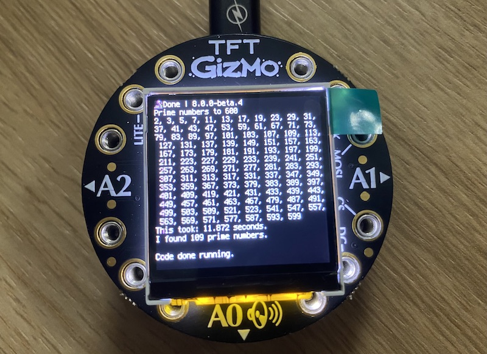

# circuit-playground-express
Collection of example programs that run on the CircuitPlayground Express. Some are equipped with a 240x240 TFT display.

It takes some time to calculate the prime numbers until 600:



It's not the fastest. With CodeHS this takes 6.7 ms and on ubuntu 20.04 with python3 just 0.324 ms. Compiled with gcc down to 14 µs or 0.000014 seconds. With output to the terminal. Some 848000x faster.

## Code to drive the display

Even though the display is slow, it is easy to implement with the right CircuitPython image with `displayio` integrated:

``` py
import displayio
from adafruit_gizmo import tft_gizmo
display = tft_gizmo.TFT_Gizmo()

import math, time
last = 600
found = 4          # we start from 11, know 2, 3, 5, 7
print(f"Prime numbers to {last}")
print('2, 3, 5, 7',end='')
start = time.monotonic()
for number in range(11, last, 2):
    prime = True
    for divider in range(3, int(math.sqrt(number))+1, 2):
        if number % divider == 0:
            prime = False
            break
    if prime:
        print(",", number, end='')
        found += 1
        prime = 1
end = time.monotonic()
print(f"\nThis took: {(end - start)} seconds.")
print(f"I found {found} prime numbers.")

```
